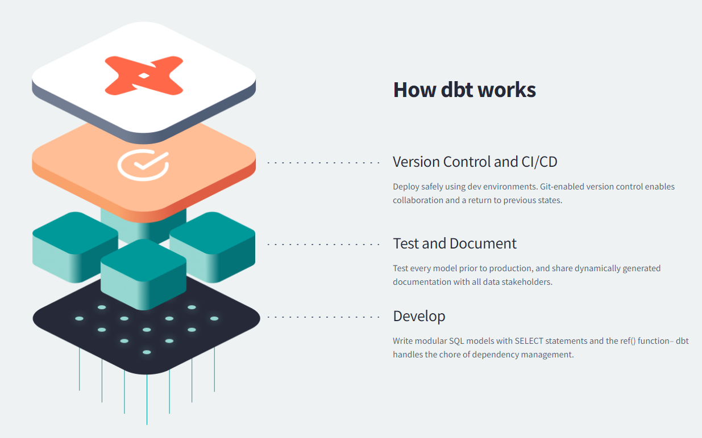
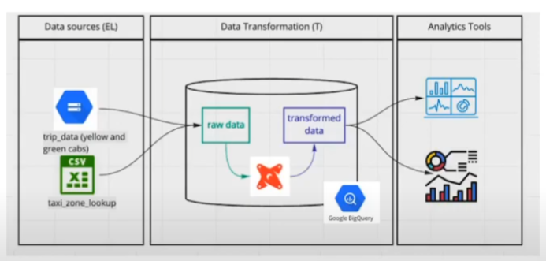

# Analytics Engineering Notes

## Dealing with Prerequistes
**Ingesting the Green Taxi Data - Years 2019 and 2020**\
I made a [file](https://github.com/rahulchaky/data-eng-camp/blob/main/week_2_data_ingestion/airflow/hw/dags/green_taxi_dag.py) to ingest the Green Taxi data. This process was slightly different as the backup csv links did not work. I ended up using the parquet files provided directly from the [NYC TLC](https://www.nyc.gov/site/tlc/about/tlc-trip-record-data.page). Then, I created a table in BigQuery using the files that were uploaded to GCS.
```
CREATE OR REPLACE EXTERNAL TABLE liquid-terra-367315.nytaxi.green_tripdata
OPTIONS (
    format = 'parquet',
    uris = [
        'gs://dtc_data_lake_liquid-terra-367315/raw/green_tripdata/2019/*',
        'gs://dtc_data_lake_liquid-terra-367315/raw/green_tripdata/2020/*'
    ]
)
```

## Setting up dbt for using BigQuery
- [Instructions](https://github.com/rahulchaky/data-eng-camp/blob/main/week_4_analytics_engineering/dbt_cloud_setup.md)
- I had no issues in setting up dbt.

## Introduction to Analytics Engineering
### What is Analytics Engineering?
- Roles in a Data Team
    - Data Engineer
        - Prepares and maintains the infrastructure the data team needs
    - Analytics Engineer
        - Introduces the good software engineering practices to the efforts of data analysts and data scientists
    - Data Analyst
        - Uses data analyst to answer questions and solve problems
- Tooling
    - Data Loading
    - Data Storing
        - Cloud data warehouses like Snowflake, BigQuery, and Redshift
    - Data Modeling
        - Tools like dbt or Dataform
    - Data Presentation
        - BI tools like Google Data Studio, Looker, Mode, or Tableau

Analytics Engineering generally deals with Data Modeling and Data Presentation.
### Data Modelling Concepts
- ETL vs ELT
    - ETL
        - Slightly more stable and compliant data analysis
        - Higher storage and compute costs
        - 
    - ELT
        - Faster and more flexible data analysis
        - Lower cost and lower maintenance
        - 

### Kimball's Dimensional Modeling
- Objective
    - Deliver data understandable to the business users
    - Deliver fast query performance
- Approach
    - Prioritize user understandability and query performance over non-redundant data [(3NF)](https://www.datanamic.com/support/database-normalization.html)
- Other Approached
    - [Bill Inmon](https://www.astera.com/type/blog/data-warehouse-concepts/#What-Are-the-Two-Data-Warehouse-Concepts-Kimball-vs-Inmon-Explained)
    - [Data Vault](https://www.data-vault.co.uk/what-is-data-vault/)

### Elements of Dimensional Modeling
- Facts Table
    - Measurements, metrics, or facts
    - Corresponds to a business *process* (for example: Sales is a business process)
    - "Verbs"
- Dimensions Tables
    - Corresponds to a business *entity* (for example: Market, Date, and Products are entities and context)
    - Provides context to a business process (provides context to the Fact Table)
    - "Nouns"

### Architecture of Dimensional Modeling
- Stage Area
    - Contains raw data (Ex: Food/Ingredient Storage in a Restaurant)
    - Not meant to be exposed to everyone
- Processing Area
    - From raw data to data models (Ex: Kitchen in a Restaurant)
    - Focuses on efficieny
    - Ensuring standards
- Presentation Area
    - Final presentation of the data (Ex: Plated and Served to the Customer in a Restaurant)
    - Exposure to business stakeholders

## What is dbt?
dbt is a transformation tool that allows anyone that knows SQL to deploy analytics code following software engineering best practices like modularity, portability, CI/CD, and documentation.



### How to use dbt?
- dbt Core
    - Open-source project that allows data transformation
    - Builds and runs a dbt project (.sql and .yml files)
    - Includes SQL compilation logic, macros (functions), and database adapters (adapts to version you are using)
    - Includes a CLI interface to run dbt commands locally
    - Free to use
- dbt Cloud
    - SaaS (Software as a Service) application to develop and manage dbt projects
    - Web-based IDE to develop, run, and test a dbt project
    - Jobs orchestration
    - Logging and Alerting
    - Integrated Documentation
    - Free for individuals

### How are we going to use dbt?
- BigQuery
    - Development using cloud IDE
    - No local installation of dbt core
    - 

## Starting a dbt Project
- Easier to use new Github repo and copy over the folder after this section is finished.
- Can only edit in not the main branch and then merge when done.

## Development of dbt Models


## Testing and Documenting dbt Models


## Deploying a dbt Project


## Visualizing the Transformed Data
