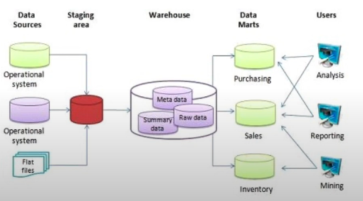

# Data Warehouse Notes

## 3.1.1 Data Warehouse and BigQuery
### OLTP vs OLAP
- **OLTP: Online Transaction Processing**
    - Purpose
        - Control and run essential business operations in real time
    - Data Updates:
        - Short, fast updates initiated by user
    - Database Design
        - Normalized databases for efficiency
    - Space Requirements
        - Generally small if historical data is archived
    - Backup and Recovery
        - Regular backups required to ensure business continuity and meet legal and governance requirements
    - Productivity
        - Increases productivity of end users
    - Data View
        - List day-to-day business transactions
    - User Examples
        - Customer-facing personnel, clerks, online shoppers
- **OLAP: Online Analytical Processing**
    - Purpose
        - Plan, solve problems, support decisions, discover hidden insights
    - Data Updates
        - Data periodically refreshed with scheduled, long-running batch jobs
    - Database Design
        - Denormalized databases for analysis   
    - Space Requirements
        - Generally large due to aggregating large datasets
    - Backup and Recovery
        - Lost data can be reloaded from OLTP database as needed in lieu of regular backups
    - Productivity
        - Increases productivity of business managers, data analysts, and executives
    - Data View
        - Multi-dimensional view of enterprise data
    - User Examples
        - Knowledge workers such as data analysts, business analysts, and executives

### What is a Data Warehouse
- Data Warehouse is an OLAP solution
- Used for reporting and data analysis\

### BiqQuery
- Serverless data warehouse
    - There are no servers to manage or database software to install
- Software as well as infrastructure including
    - **Scalability** and **High Availability**
- Built in Features:
    - Machine Learning
    - Geospatial Analysis
    - Business Intelligence
- BigQuery maximizes flexibility by separating the compute engine that analyzes your data from your storage

### BigQuery Cost
- On Demand Pricing
    - 1 TB of data processed is $5
- Flat Rate Pricing
    - Based on number of pre-requested slots
    - 100 slots -> $2,000/month = 400 TB data processed on demand pricing

## 3.1.2 Partioning and Clustering
### BigQuery Partitioning
- A way to divide a table into related parts
- You can choose to partition on:
    - Time-Unit Column
    - Ingestion Time
        - Note: When using Time-Unit Column or Ingestion Time you can partition data
            - Daily (Default)
            - Hourly
            - Monthly or Yearly
    - Integer Range
- Note: BigQuery limits number of partitions to 4000

### BigQuery Clustering
- Columns you specify are used to colocate related data
- Order of columns is important
- The order of specified columns determines the sort order of the data
- Clustering improves:
    - Filter queries
    - Aggregate queries
- Tables with data size < 1GB, don't show significant improvement with partitioning and clustering
- You can specify up to 4 clustering columns
- Clustering columns must be top-level, non-repeated columns
- Clustering columns can be of these types:
    - Date
    - Bool
    - Geography
    - Int64
    - Numeric
    - BigNumeric
    - String
    - Timestamp
    - DateTime

### Partitioning vs Clustering
- **Clustering**
    - Cost benefit unknown
    - You need more granularity than partitioning alone requires
    - Your queries commonly use filters or aggregation against multiple particular columns
    - The cardinality of the number of values in a column or group of columns is large

- **Partitioning**
    - Cost known upfront
    - You need partition-level management
    - Filter or aggregate on single column

### When do you choose Clustering over Partitioning
- Partitioning results in a small amount of data per partition (approximately less than 1 GB)
- Partitioning results in a large number of partitions beyond the limit (4000) on partitioned tables
- Partitioning results in your mutation operations modifying the majority of partitions in the table frequently (for example, every few minutes)

### Automatic Reclustering
- As data is added to a clustered table
    - The newly inserted data can be written to blocks that contain key ranges that overlap with key ranges in previously written blocks
    - These overlapping keys weaken the sort property of the table
- To maintain the performance characteristics of a clustered table
    - BigQuery performs automatic re-clustering in the background to restore the sort property of the table
    - For partitioned tables, clustering is maintained for data within the scope of each partition
- Automatic Reclustering has no cost on the end-user

## 3.2.1 BigQuery Best Practices
### Cost Reduction
- Avoid `SELECT *`
- Price your queries before running them
- Use clustered or partitioned tables
- Use streaming inserts with caution
- Materialize query results in stages

### Query Performance
- Filter on partitioned columns
- Denormalizing data
    - Denormalization is a database optimization technique in which we add redundant data to one or more tables.
    - This can help us avoid costly joins in a relational database.
- Use nested or repeated columns
- Use external data sources appropriately
- Don't use it, in case you want high query performance
- Reduce data before using a `JOIN`
- Do not treat `WITH` clauses as prepared statements
- Avoid oversharing tables
- Avoid Javascript user-defined functions
- Use approximate aggregation functions (HyperLogLog++)
- `Order` statements should be the last part of your query, for query operations to maximize performance
- Optimize your join patterns
    - As a best practice, place the table with the largest number of rows first, followed by the table with the fewest rows, and then place the remaining tables by decreasing size.

### [Homework w/ Solutions](https://github.com/rahulchaky/data-eng-camp/blob/main/lab/data_warehouse_lab/homework.md)